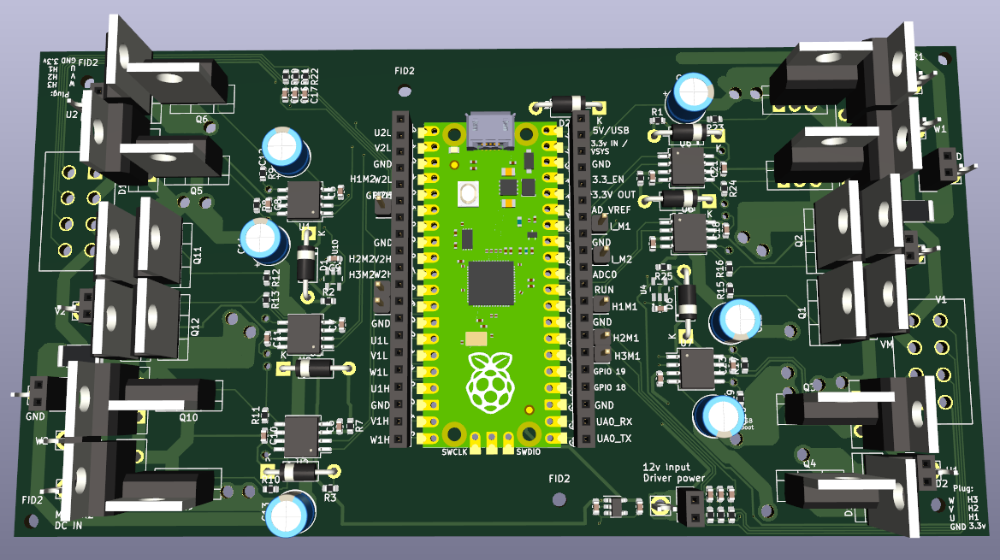

# DualBLDCController
One RP2040 Pico drives two brushless motors! Uses SimpleFOC + Halls + TO-220 mosfets or IGBTs. Trying for low cost + lots of flexibility + solder it yourself at home + repairable. Works as a 3x DC motor controller as well.

**Features**

RP2040 Pico running Simplefoc (https://simplefoc.com/) and using halls (or -untested but should be possible- encoders) for motor commutation. (No FOC - RP2040 doesn't have enough A/D channels for 2x motor FOC.) Current sensing: 1 A/D channel and shunt resistor per motor. Uses 2304 half-H drivers. Can assemble only half the board if you only want one servo amp / want more pico I/O's. Spot for big diodes if you want 'em - Big motors seem to eat my mosfet body diodes rather quickly and IGBT's don't have body diodes. 

Control via usb serial or hardware serial. I2C, SPI, and software CAN might work but are untested. Serial is Human readable, following the simplefoc commander schema: AE1 enables motor, A10 sets motor A to 10 rev/sec, A0 stops motor A. AE0 quickly drops power to motor a. etc... B10 sets motor B to 10 rev/sec... etc... This allows you to control, test, and modify this servo amp right from the Arduino IDE or pretty much anything with a USB port or serial port.

Boards have a spot for molex plugs that are pin compatible with Husqvarna 450x automower drive motors. (NOT the cut motor - it's a different pinout but you can re-pin the cut motor to match the drive motors and zoom off you go.) 

Board requires your motor power DC source, and ~12vdc@ say 50mA. The board can either make 3.3v for the RP2040 pico, or you can provide external 3.3v. 

There's a very simple heartbeat signal in the code - if the amp doesn't get an instruction from serial it'll shut down, or delete that line to go forever!

**Assembly/Setup:**

Boards require SMD paste soldering and normal soldering to build: 

- SMD: It's not bad, order a solder mask when you order the board, place components, toaster oven for 3 mins. All SMD components are on the same side of the board. No Tiny SMD stuff like the rp2040 chip itself - that's why we use a pico. All diodes are NOT SMD so you can tell which direction they go. (I can never see the tiny lines.) 
- Normal: in particular the mosfets. They are TO-220 because you are a hacker. You can solder in mosfets you have laying around and then de-solder them yourself to put better ones in. Or put in 3x0.1" pin headers so you can just plug in mosfets when you inevitably dead short them after trying to roll your own 3 phase driver. Basically you might want to 1. swap mosfets lots as you scratch write a 3phase driver. 2. use whatever mosfets are around. 3. repair it yourself. All of these would wreck a normal board but here you can just break out your trusty soldering iron and fix this board instead of throwing it in the trash!
- Make sure you order 2oz copper board so you get thick traces and can use higher current.

If you don't want to use the A/D (or want to repurpose any other inputs/outputs after you get a board you can cut the trace to that pin, and there's a tinned hole for you to take over. And again, you don't have to build both servo amps if you want more IO's. 

'Firmware' for the rp2040 has some basic configuration and setup instructions in comments at the top of the code. It's pretty well tested and has been running for days without failing on an automower. There are two other firmware versions - one example for 3x DC motors, and one old version based on (https://github.com/ClemensElflein/xESC2040/tree/main/firmware/src) that does not use simplefoc. Both 'other' firmware versions need their pins.h file checked to be sure they follow the current board pico pin assignments, but should be more or less functional other than that afaik. Let's call them good starting points. 

**Tested**

Tested using velocity control and torque control up to 10A/21v. Running in a Husqvarna 450x Automower as I write this. Maybe 10 hours of operation so far. Will update if/when anything fails.

Tested with 3x brushed (non 3 phase) motors using https://github.com/simplefoc/Arduino-FOC-dcmotor  - worked great but I did not test feedback, just that it could spin the motors. Off the top of my head there's only enough pico pins for 2x quadrature encoders.

**Thank you**

Big thank you to https://github.com/ClemensElflein/ for creating the Open Mower project and his very well thought out 3 phase rp2040 servo amp code. His project inspired me to take the leap and make this happen. This board can(at least used to!) run (a version of?)his Xesc2040 servo amp code but you would have to change the xesc2040 pins.h, and possibly more IDK. The original plan was use the openmower framework to control this servo amp but I ended up going a different direction.

SimpleFOC is absolutely brilliant. Can't recommend enough. If you are making bldc controllers they are a great place to start!

Thanks to everyone who open sources their work - makes the world a better place. Hope my code helps you!

**Plans/Stuff that's broken, rough order:**

- Current sense is at best not super calibrated, at worst needs work. Functions well enough to shut down the amp if current limit is hit.
- Test both DC and BLDC motors with an encoder instead of halls.
- Build more robots using this amp.
- Test it up to 240vdc/10A. Should work?
- Connect JUST the 2304's to a Mesa FPGA board running linuxCNC. Yep. Dump the pico and put your own brain on these drivers.
- I2C should work via pico pins GP17 and GP16. I think there is also now software CAN for the 2040 - loose 25% or so of one core but get CAN. Should be able to get it working.

**Next board iteration:**

- Going to be a while. I've got enough of these boards for my next couple years of planned projects. Maybe...2027 or so we'll fix this stuff and anything else that shows up. Only thing that will trigger a sooner update is if high voltage doesn't work.
- Heat sinks: Mosfet locations are not in a nice line. We've got 1 sink per mosfet, and once we start using more power we might want some real cooling here not just tiny heat sinks to air. Is it worth the pain of moving everything? Eh... Maybe. Might be easier to just machine the right pockets/holes into an aluminum block. 
- Fix the onboard 3.3v - Turns out you're not supposed to use linear regulators as DC-DC converters. Oops. It works but wastes 40mA.+ Leaning towards deleting it 'cause 3.3v or 5v can come from RPi or BBB or pretty much any other board you use to drive this. AND if you have external 3.3v you can dump power to the pico even if you leave the DC main power connected.
- Make the power input and GND holes large enough to accommodate 12Ga wire.
- Fix various labels on the board. FID2 looking at you.

Cheers!
-Fault Risk
